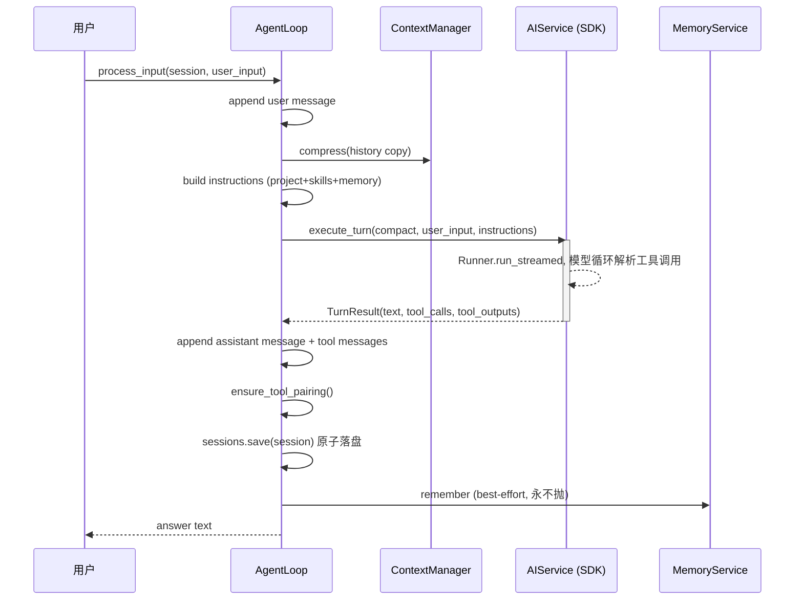

# 架构设计

ai-coding 是一个分层、SDK 可替换的对话式编码助手：领域契约（`domain`）、编排（`core`/`security`/`memory`）是自家实现且与运行时引擎解耦；OpenAI Agents SDK 只作为 `ai` 层一个可替换引擎插入。

## 包结构与依赖方向

```
ai_coding/
├─ cli.py          entrypoint：命令注册、组合根装配（唯一接触全部层的编排）
├─ domain/         纯数据契约 dataclass，零业务依赖，最底层
├─ config/         配置模型（Pydantic）与 YAML 加载，仅依赖 domain + pydantic/yaml
├─ infra/          标准库封装：json / file / time / logger，仅依赖 stdlib
├─ security/       沙箱、权限门、审批回调、过期读保护
├─ tools/          工具契约 + 8 个工具 + 注册表 + SDK 适配 + 工具栈装配
├─ ai/             引擎端口与 OpenAI Agents SDK 适配、Prompt 装配、LLM 辅助
├─ core/           回合编排、上下文压缩、MCP 管理、子代理、worktree、项目说明
├─ service/        会话持久化
├─ memory/         记忆检索 / 提取 / 聚合
├─ skills/         技能目录注册表
└─ ui/             REPL 交互 + slash 解析 + 富文本控制台
```

依赖方向是单向的：`domain` 不被任何层反向 import；`config`/`infra` 只依赖 `domain`/标准库；AI 领域逻辑依赖 `domain`+`ai.base`（端口），不直接依赖 SDK 具体类型。全项目只有两个模块 import `agents`：`ai/agents_sdk_service.py`（引擎适配）与 `tools/sdk_adapter.py`（工具适配）。

## 模块职责

| 包 | 职责 | 关键入口 |
|---|---|---|
| `domain` | 不可变数据契约，作为跨层共用边界 | `ChatMessage`、`SessionData`、`TurnResult`、`ModelConfig` |
| `config` | 配置模型、YAML 加载、camel→snake 归一化、默认值 | `ConfigLoader`、`ConfigManager`、`AppConfig` |
| `infra` | JSON/文件/时间/日志工具 | `json_utils`、`file_utils`、`time_utils`、`logger_setup` |
| `security` | 失败关闭的安全层 | `Sandbox`、`PermissionGate`、`ApprovalCallback`、`FileStateTracker` |
| `tools` | 工具契约与实现、注册表、SDK 适配、装配 | `BaseTool`、`ToolRegistry`、`build_tool_stack`、`sdk_adapter` |
| `ai` | 引擎端口 + SDK 适配 + 提示组装 + LLM 辅助 | `AIService`、`AgentsSDKChatService`、`PromptAssembler` |
| `core` | 编排与增强逻辑 | `AgentLoop`、`ContextManager`、`MCPManager`、`SubAgentRunner`、`WorktreeManager` |
| `service` | 会话读写（原子） | `SessionService` |
| `memory` | 记忆三层操作与持久化 | `MemoryService`、`MemoryStore` |
| `skills` | 技能目录扫描与目录文本 | `SkillRegistry` |
| `ui` | 交互终端与命令解析 | `run_repl`、`parse_slash`、`DialogueConsole` |

## SDK 边界

引擎适配层（`ai`/`tools`）把 SDK 细节吸收在两个边界处：

- `AIService.execute_turn(history, user_input, token_sink, instructions)` 是 AI 端口。`AgentsSDKChatService` 把 `ChatMessage` 历史映射为 SDK input items，用 `Runner.run_streamed` 流式驱动，再把 `message_output_created`/`tool_called`/`tool_output` 事件收集回领域 `TurnResult`。构造完全离线，只有真跑回合才触网。
- `sdk_adapter.py` 把 `BaseTool` 包装为 SDK FunctionTool，其中 `needs_approval` 由 `PermissionGate` 决策 + `approval` 回调共同决定是否放行。

换引擎只需提供新的 `AIService` 实现，领域层、编排、会话、记忆、UI 均不受影响。

## 组合根与装配

CLI 是组合根。`cli._build_loop` 一次性装配 M3 起的所有可选组件，缺省静默降级：

```
ConfigManager.initialize(path) ─→ AppConfig + MCPConfig
   │
   ├─ build_tool_stack(app_cfg, workspace, skills, approval)
   │     └─ Sandbox + FileStateTracker + PermissionGate(Decision)
   │     └─ ToolRegistry(8 tools) → registry_to_sdk_tools(registry, gate, approval)
   │     └─ subAgent → SubAgentRunner(build_service, build_tools) + WorktreeManager
   │
   ├─ build_service_from_config(app_cfg, tools) → AgentsSDKChatService(+MCPManager servers)
   │
   └─ _build_loop(...) →
         AgentLoop(service, sessions,
                   context=ContextManager(+LLM summarizer),
                   memory=MemoryService(+LLM extractor, MemoryStore(.memory)),
                   prompt=PromptAssembler(base),
                   skills=SkillRegistry, project=ProjectInstructionsLoader)
```

关键接线规则：`approval=None` 默认非交互自动批准 WARN（`ask`）；`repl` 显式传入 `CLIApprovalCallback` 交互确认；子代理内部栈恒用自动批准（隔离 worktree 内无人可确认）。LLM 化组件（摘要器/提取器）仅在真实 `ModelConfig` 存在时接线，单测假对象保持离线默认，任何测试都不触网。

## 回合数据流



SDK 内部自动处理「模型发起工具调用 → 执行 → 结果回喂 → 继续生成」的多轮内部循环，`execute_turn` 只需收集最终文本、调用引用与成对的工具输出。

## 扩展点

换引擎实现 `AIService`；新增工具继承 `BaseTool` 并在 `registry.register` 注册；改变审批策略实现 `ApprovalCallback`（或替换门禁决策）；接入任意工具集通过 `build_tool_stack` 的自定义装配；LLM 辅助通过 `summarizer`/`extractor` 可调用注入。

## 设计取舍

- **失败关闭**：未知工具与无回调的 WARN 层默认保守处理，DENY 永不因回调而放行；交互入口才放开确认。
- **静默降级**：记忆、L4 摘要、worktree 隔离等增强组件失败时回退而非中止会话，保持主链路可用。
- **字节兼容**：会话 JSON 与 Java 旧格式一致，历史会话可无缝迁移。
- **只改副本**：上下文压缩在历史副本上进行，绝不污染调用方状态。